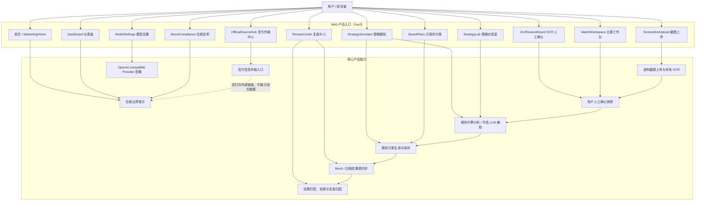
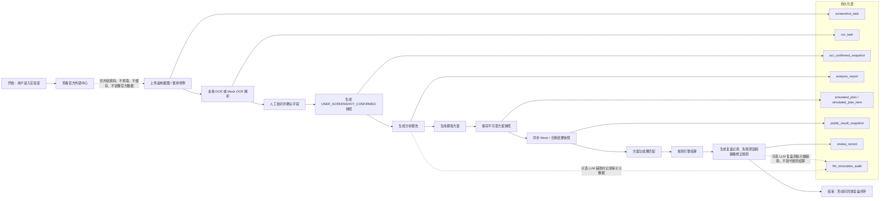
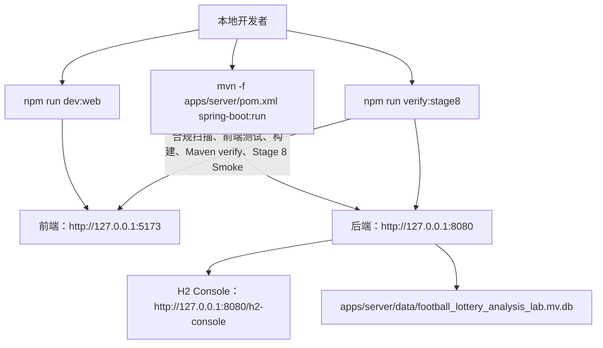

# 产品架构图

本文档描述 Football Lottery Analysis Lab 当前阶段的产品架构、技术架构和核心数据流。项目定位为非官方、开源、模拟分析与赛后复盘实验室，仅支持虚构样例、本地 OCR 确认、模拟方案生成、结果匹配与复盘研究。

## 1. 产品功能架构图



## 2. 前后端技术架构图

```mermaid
flowchart TB
  browser["浏览器"]

  subgraph frontend["前端应用：apps/web"]
    vite["Vite + TypeScript"]
    router["Vue Router"]
    views["页面组件：Dashboard / OCR / Strategy / Review / Model"]
    apiClients["API 模块：analysis / ocrWorkflow / simulatedPlans / reviews / modelProviders"]
    stores["Pinia Store：appStatus / ocrWorkflow / simulatedPlan / resultProvider / analysisReport"]
  end

  subgraph backend["后端应用：apps/server"]
    spring["Spring Boot 3 API"]
    commonResult["统一响应 Result<T>"]

    subgraph controllers["Controller 层"]
      officialController["OfficialLinkController"]
      ocrController["OcrWorkflowController"]
      analysisController["AnalysisController"]
      planController["SimulatedPlanController"]
      resultController["PublicResultProviderController"]
      reviewController["ReviewWorkflowController"]
      modelController["ModelProviderController / EngineSettingsController"]
      strategyController["StrategyParameterDefaultsController"]
    end

    subgraph services["Service / Engine 层"]
      officialService["OfficialLinkService"]
      ocrService["OcrWorkflowService"]
      analysisService["AnalysisService"]
      ruleEngine["MockRuleAnalysisEngine"]
      llmAnalysisEngine["OpenAiCompatibleAnalysisEngine"]
      planService["SimulatedPlanService"]
      resultService["MockPublicResultProviderService"]
      reviewService["ReviewWorkflowService"]
      llmReviewEngine["OpenAiCompatibleReviewInsightEngine"]
      llmRegistry["LlmProviderRegistry / EngineSettingsService"]
      llmAudit["LlmInvocationAuditService"]
      validator["StrategyParameterValidator / LlmOutputValidator / SafetyGuardService"]
    end

    subgraph repositories["Repository 层（JDBC）"]
      ocrRepo["JdbcOcrWorkflowRepository"]
      analysisRepo["JdbcAnalysisReportRepository"]
      planRepo["JdbcSimulatedPlanRepository"]
      resultRepo["JdbcPublicResultSnapshotRepository"]
      reviewRepo["JdbcReviewRecordRepository"]
      auditRepo["JdbcLlmInvocationAuditRepository"]
    end
  end

  subgraph database["数据层"]
    flyway["Flyway Migration"]
    h2["H2 Embedded File DB（默认）"]
    mysql["MySQL 迁移目标（预留）"]
  end

  subgraph external["外部边界"]
    officialSite["官方网站：外链打开"]
    userScreenshot["用户上传 / 虚构截图样例"]
    mockProvider["Mock / 合规公开结果源"]
    llmProvider["OpenAI-compatible LLM Provider"]
    env["后端环境变量：API Key"]
  end

  browser --> frontend
  vite --> router --> views
  views --> apiClients
  views --> stores
  stores --> apiClients

  apiClients -->|"HTTP JSON /api/*"| spring
  spring --> commonResult
  spring --> controllers
  controllers --> services
  services --> repositories
  repositories --> h2
  flyway --> h2
  flyway -.->|"兼容性检查后可迁移"| mysql

  officialController --> officialService
  ocrController --> ocrService
  analysisController --> analysisService
  planController --> planService
  resultController --> resultService
  reviewController --> reviewService
  modelController --> llmRegistry
  strategyController --> validator

  analysisService --> ruleEngine
  analysisService --> llmAnalysisEngine
  reviewService --> llmReviewEngine
  llmAnalysisEngine --> llmRegistry
  llmReviewEngine --> llmRegistry
  llmAnalysisEngine --> llmAudit
  llmReviewEngine --> llmAudit
  llmAudit --> auditRepo

  official -.->|"target=_blank，rel=noopener noreferrer"| officialSite
  upload --> userScreenshot
  resultService --> mockProvider
  llmRegistry --> env
  llmRegistry --> llmProvider
```



## 3. 核心业务闭环数据流图



## 4. 本地运行架构



## 5. 合规与安全边界

- 项目是非官方实验室，不构成购彩建议、收益承诺或命中保证。
- 不提供真实购彩、支付、出票、代买、合买、跟单、充值、提现等能力。
- 不实现官方数据爬虫、官方页面镜像、官方数据缓存或绕过验证机制。
- 官方信息仅作为外部链接入口，前端使用新窗口打开，不在系统内展示官方数据。
- 赛前输入来自用户上传截图、本地 OCR、Mock OCR 或手工确认，未经用户确认的 OCR 结果不得进入分析与模拟方案生成。
- LLM Provider 是可选能力，API Key 只读取后端环境变量，不返回前端，不写入数据库、日志或测试快照。
- LLM 输出必须经过结构化校验和安全校验；规则引擎仍然是结算与复盘状态的最终依据。
- 本地默认数据库为 H2 Embedded File，Flyway 管理 schema；后续可按 `application-mysql.example.yml` 切换到 MySQL。

## 6. 主要验证入口

```shell
npm run compliance:scan
npm run test:web
npm run build:web
npm run verify:server
npm run verify:stage8
```

`verify:stage8` 是当前完整闭环验证入口，覆盖合规扫描、前端类型与单元测试、前端构建、后端 Maven 验证、配置校验和 Stage 8 API / 浏览器 Smoke 流程。
