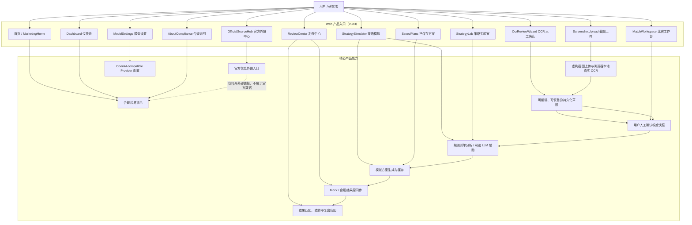
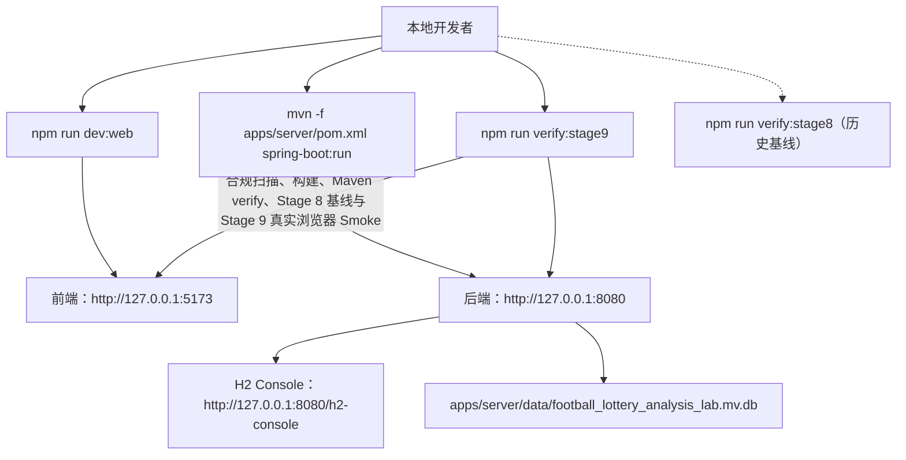

# 产品架构图

本文档描述 Football Lottery Analysis Lab v0.2.0 的已实现产品架构、技术架构和核心数据流。项目定位为非官方、开源、模拟分析与赛后复盘实验室，仅支持虚构样例、浏览器本地 OCR、人工确认、模拟方案生成、结果匹配与复盘研究。

## 1. 产品功能架构图



## 2. 前后端技术架构图

```mermaid
flowchart TB
  browser["浏览器"]

  subgraph frontend["前端应用：apps/web"]
    vite["Vite + TypeScript"]
    router["Vue Router"]
    views["页面组件：Dashboard / OCR / Strategy / Review / Model"]
    localOcr["同源 Tesseract.js 运行时与本地语言资产"]
    imageWorkspace["浏览器内旋转 / 裁剪 / 遮挡工作区"]
    apiClients["API 模块：analysis / ocrWorkflow / simulatedPlans / reviews / modelProviders"]
    stores["Pinia Store：appStatus / ocrWorkflow / simulatedPlan / resultProvider / analysisReport"]
  end

  subgraph backend["后端应用：apps/server"]
    spring["Spring Boot 3 API"]
    commonResult["统一响应 Result<T>"]

    subgraph controllers["Controller 层"]
      officialController["OfficialLinkController"]
      ocrController["OcrWorkflowController"]
      analysisController["AnalysisController"]
      planController["SimulatedPlanController"]
      resultController["PublicResultProviderController"]
      reviewController["ReviewWorkflowController"]
      modelController["ModelProviderController / EngineSettingsController"]
      strategyController["StrategyParameterDefaultsController"]
    end

    subgraph services["Service / Engine 层"]
      officialService["OfficialLinkService"]
      ocrService["OcrWorkflowService"]
      draftService["OcrReviewDraftService / OcrConfirmationService"]
      operationService["WorkflowOperationService / RecoveryService"]
      analysisService["AnalysisService"]
      ruleEngine["MockRuleAnalysisEngine"]
      llmAnalysisEngine["OpenAiCompatibleAnalysisEngine"]
      planService["SimulatedPlanService"]
      resultService["MockPublicResultProviderService"]
      reviewService["ReviewWorkflowService"]
      llmReviewEngine["OpenAiCompatibleReviewInsightEngine"]
      llmRegistry["LlmProviderRegistry / EngineSettingsService"]
      llmAudit["LlmInvocationAuditService"]
      validator["StrategyParameterValidator / LlmOutputValidator / SafetyGuardService"]
    end

    subgraph repositories["Repository 层（JDBC）"]
      ocrRepo["JdbcOcrWorkflowRepository"]
      draftRepo["JdbcOcrReviewDraftRepository"]
      workflowRepo["JdbcWorkflowRepository / OperationRepository"]
      analysisRepo["JdbcAnalysisReportRepository"]
      planRepo["JdbcSimulatedPlanRepository"]
      resultRepo["JdbcPublicResultSnapshotRepository"]
      reviewRepo["JdbcReviewRecordRepository"]
      auditRepo["JdbcLlmInvocationAuditRepository"]
    end
  end

  subgraph database["数据层"]
    flyway["Flyway Migration"]
    h2["H2 Embedded File DB（默认）"]
    mysql["MySQL 迁移目标（预留）"]
  end

  subgraph external["外部边界"]
    officialSite["官方网站：外链打开"]
    userScreenshot["用户上传 / 虚构截图样例"]
    mockProvider["Mock / 合规公开结果源"]
    llmProvider["OpenAI-compatible LLM Provider"]
    env["后端环境变量：API Key"]
  end

  browser --> frontend
  vite --> router --> views
  views --> imageWorkspace --> localOcr
  views --> apiClients
  views --> stores
  stores --> apiClients

  apiClients -->|"HTTP JSON /api/*"| spring
  spring --> commonResult
  spring --> controllers
  controllers --> services
  services --> repositories
  repositories --> h2
  flyway --> h2
  flyway -.->|"兼容性检查后可迁移"| mysql

  officialController --> officialService
  ocrController --> ocrService
  ocrController --> draftService
  ocrService --> operationService
  draftService --> operationService
  analysisController --> analysisService
  planController --> planService
  resultController --> resultService
  reviewController --> reviewService
  modelController --> llmRegistry
  strategyController --> validator

  analysisService --> ruleEngine
  analysisService --> llmAnalysisEngine
  reviewService --> llmReviewEngine
  llmAnalysisEngine --> llmRegistry
  llmReviewEngine --> llmRegistry
  llmAnalysisEngine --> llmAudit
  llmReviewEngine --> llmAudit
  llmAudit --> auditRepo

  ocrService --> ocrRepo
  draftService --> draftRepo
  operationService --> workflowRepo

  official -.->|"target=_blank，rel=noopener noreferrer"| officialSite
  upload --> userScreenshot
  localOcr -.->|"只在浏览器内处理；不上传原图或完整 OCR 文本"| userScreenshot
  resultService --> mockProvider
  llmRegistry --> env
  llmRegistry --> llmProvider
```



## 3. 核心业务闭环数据流图

```mermaid
flowchart LR
  start["开始：用户进入实验室"]
  linkHub["查看官方外链中心"]
  upload["上传虚构截图 / 使用样例"]
  parse["浏览器本地真实 OCR / 手工空白录入"]
  draft["编辑并保存 WDL-only 草稿（revision CAS）"]
  recover["刷新页面或后端进程重启后恢复草稿"]
  snapshot["确认并生成 SERVER_CONFIRMED_V2 权威快照"]
  analysis["从权威快照生成报告"]
  simulate["从权威报告生成模拟方案"]
  save["保存不可变方案快照"]
  sync["同步 Mock / 合规结果快照"]
  match["方案与结果匹配"]
  settle["规则引擎结算"]
  postReview["生成复盘记录、失败原因和策略修正规则"]
  endNode["结束：形成可回放复盘闭环"]

  subgraph storage["持久化表"]
    screenshotTask["screenshot_task"]
    ocrTask["ocr_task"]
    workflow["ocr_workflow"]
    operation["workflow_operation"]
    reviewDraft["ocr_review_draft"]
    confirmedSnapshot["ocr_confirmed_snapshot"]
    analysisReport["analysis_report"]
    simulatedPlan["simulated_plan / simulated_plan_item"]
    publicResult["public_result_snapshot"]
    reviewRecord["review_record"]
    llmAuditTable["llm_invocation_audit"]
  end

  start --> linkHub
  linkHub -.->|"仅外链跳转，不抓取、不缓存、不镜像官方数据"| upload
  upload --> workflow
  upload --> screenshotTask
  upload --> parse
  parse --> ocrTask
  parse --> draft
  draft --> reviewDraft
  reviewDraft --> recover --> draft
  draft --> snapshot
  snapshot --> confirmedSnapshot
  snapshot --> analysis

  analysis --> analysisReport
  analysis -.->|"可选 LLM 辅助时记录审计元数据"| llmAuditTable
  analysis --> simulate
  simulate --> save
  save --> simulatedPlan
  save --> sync
  sync --> publicResult
  sync --> match
  match --> settle
  settle --> postReview
  postReview --> reviewRecord
  postReview -.->|"可选 LLM 复盘洞察只做辅助，不替代规则结算"| llmAuditTable
  postReview --> endNode

  workflow -.->|"stage/version CAS"| draft
  operation -.->|"Idempotency-Key + request SHA-256"| snapshot
  confirmedSnapshot -.->|"workflowId + snapshotId + confirmedRevision"| analysisReport
  analysisReport -.->|"workflowId + reportId + snapshotId"| simulatedPlan
```



权威链按 `ocr_workflow -> ocr_confirmed_snapshot -> analysis_report -> simulated_plan` 向下传递。后端校验 `workflowId`、权威资源 ID、revision、`authorityType` 与 schema version；客户端提交的分析内容或方案内容不能替代服务器生成的权威记录。确认前草稿只允许每场一个 WDL（胜/平/负）选择，其他玩法不会进入 v0.2.0 权威链。

写操作使用 UUID `Idempotency-Key`、请求摘要和工作流版本/草稿 revision 的 compare-and-set（CAS）。同键同请求可安全重放，同键不同请求或过期 revision 返回冲突；旧 `POST /api/ocr/review/confirm` 固定返回 HTTP 410 `LEGACY_CONFIRM_ENDPOINT_REMOVED`，作为内部 API breaking migration 的明确 tombstone。

## 4. 本地运行架构



Stage 9 Smoke 使用独立的临时 H2 文件数据库、受控后端进程和持久化 Chromium profile。它验证同一 run 内的冷/暖 OCR、草稿刷新恢复、后端进程重启恢复、确认、分析、方案保存与深链接；结束后清理临时数据库，不读取或覆盖开发者的 `apps/server/data/`。

## 5. 合规与安全边界

- 项目是非官方实验室，不构成购彩建议、收益承诺或命中保证。
- 不提供真实购彩、支付、出票、代买、合买、跟单、充值、提现等能力。
- 不实现官方数据爬虫、官方页面镜像、官方数据缓存或绕过验证机制。
- 官方信息仅作为外部链接入口，前端使用新窗口打开，不在系统内展示官方数据。
- 赛前输入来自用户上传的虚构截图、浏览器本地真实 OCR 或手工录入；原图和完整 OCR 文本不进入后端，后端只接收用户选定的结构化候选字段，未经用户确认不得进入分析与模拟方案生成。
- 浏览器 OCR 运行时和语言资产由应用同源提供；OCR 流程拒绝跨源网络依赖，避免把用户图像交给第三方 OCR 服务。
- OCR 草稿持久化到本地后端数据库，可跨页面刷新和后端进程重启恢复；确认前放弃会清除候选与草稿正文，仅保留最小 `ABANDONED` tombstone 和幂等审计信息。
- LLM Provider 是可选能力，API Key 只读取后端环境变量，不返回前端，不写入数据库、日志或测试快照。
- LLM 输出必须经过结构化校验和安全校验；规则引擎仍然是结算与复盘状态的最终依据。
- 本地默认数据库为 H2 Embedded File，Flyway 管理 schema；后续可按 `application-mysql.example.yml` 切换到 MySQL。

## 6. 主要验证入口

```shell
npm run compliance:scan
npm run test:web
npm run build:web
npm run verify:server
npm run verify:stage8
npm run verify:stage9
```

`verify:stage9` 是 v0.2.0 当前发布候选门禁，覆盖合规扫描、前端测试与构建、后端 Maven 验证、Stage 8 历史基线以及 Stage 9 真实浏览器端到端流程。`verify:stage8` 仍保留为 Stage 8 历史回归入口，不再代表当前发布门禁。Mock provider 与 `MockRuleAnalysisEngine` 仍是合规、可重复的默认结果源与规则分析实现；Stage 9 的“真实”仅指浏览器本地 OCR 运行路径，不表示接入真实官方数据或真实投注。
